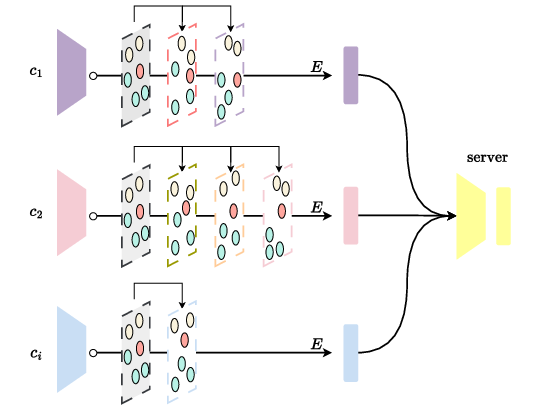

# Adaptive Local Training in Federated Learning

<div align="center">

[](https://medialab.dei.unipd.it/paper_data/ALT/AdaptiveLocalTraining.pdf)
[](https://medialab.dei.unipd.it/paper_data/ALT/poster.pdf)
[](#Citation)

</div>


**PyTorch implementation** of: D. Shenaj, E. Belilovky, and P. Zanuttigh, “Adaptive Local Training in Federated Learning”, EUSIPCO 2025. A non-archival version of the work has also been presented at the ILCR 2025 Workshop on Modular, Collaborative and Decentralized Deep Learning.

**Corresponding author:** dshenaj@gmail.com

<div align='center'>

</div>


## Summary

In federated learning  multiple clients collaboratively train a global machine learning  model by exchanging their locally trained model weights instead of raw data.
In the standard setting, every client trains its local model for the same number of epochs.
We introduce ALT (Adaptive Local Training), a simple yet effective feedback mechanism that can be introduced on top of any federated learning scheme at the client side to limit unnecessary and degrading computations. ALT dynamically adjusts the number of training epochs for each client based on the similarity between the local representation and the global one, ensuring that well-aligned clients can train longer without experiencing client drift while in case of too large drifts the training is stopped earlier. We evaluated ALT on federated partitions of the CIFAR-10 and Tiny-ImageNet datasets, demonstrating its effectiveness in improving both model convergence speed and accuracy.


### Experiments' logging

Make a new [wandb](https://wandb.ai/site) account if you do not have one yet, create a new wandb project and set the `wandb_entity` parameter in the config files. To disable it set `wandb=offline` in the config file.


### Environment

Create a new conda environment using:
```
conda env create --name ALT --file=ALT.yml
```


### How to run

In the configs folder, it is possible to find examples of config files for some of the experiments to replicate the
results of the paper. Run one of the exemplar configs or a custom one from the root path of your local copy of the
repository:

```
./run.sh [path/to/config]
```

N.B. always leave a blank new line at the end of the config. Otherwise, your last argument will be ignored.

<a name="Citation"></a>
## Cite us
If you find our work relevant to your research and you use this repository, please consider to cite:

```
@inproceedings{shenaj2025adaptive,
  title={Adaptive Local Training in Federated Learning},
  author={Shenaj, Donald and Belilovsky, Eugene and Zanuttigh, Pietro},
  year={2025}
  booktitle={Proceedings of 33rd European Signal Processing Conference (EUSIPCO 2025)}
}
```
